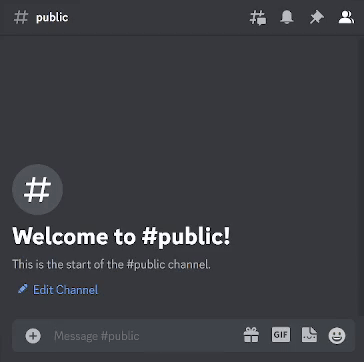

# codenames-bot-discord14

The bot currently supports discord.js v14

This is a work in progress the original implementation is written is index.ts and is a limited working POC. I am working on refactoring this into something more robust.



# Installation
- Download the latest version of node-js
- Create Application in discord developer portal
    - Create a bot with message read and bot permissions
    - Give bot administrator
    - Generate link and add bot to server
    - copy api key
Clone this repository

Add API Token and User ID to new file .env within repo
```
TOKEN=<YOUR BOTS TOKEN>
ID=<YOUR DISCORD USER ID#NUMBER>
```
In a powershell session run the following:
```
npm init -y
npm install discord.js dotenv
```
In an admin powershell session run the following:
```
Set-ExecutionPolicy -ExecutionPolicy RemoteSigned
npm install -g ts-node
```

# Starting the Bot
Your bot is now ready to be launched with:
```
ts-node index
```

# Commands
|Command|Description|Requirement|
|---|---|---|
|-new|Generates a new board with words randomly placed|None|
|-key|Generates a new board color key with colors randomly placed|```-new```|
|-g GUESS|Guesses a word from public channel board, updates master key board in spymasters channel accordingly|```-new``` and ```-key```|
|-wipe|Clears last 100 messages in channel, if ```new``` and ```key``` have been run then it clears all messages in public and spymaster channel. (useful between games)||